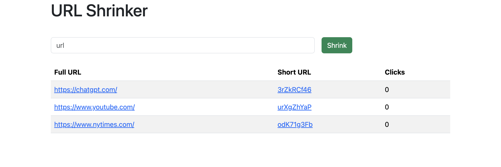

# Express JS URI shortener

A simple node JS / Express JS web application for shortening urls. 

Bootstrap is used for styling, and a mongodb database is used for storing the data.

# How to run

1. start the database: run `docker-compose up --build` in the terminal.

2. Start the webserver: go to a terminal and run the command `npm run devStart`.

The website is now running on localhost:5000